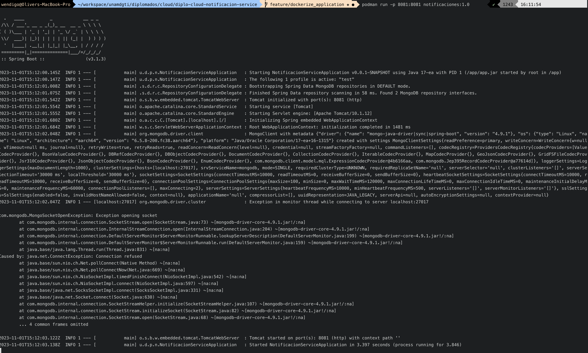

# Getting Started

## Project

Implementation of notification microservice for the Pixup application.
The notification will be created for the following event:
- User Register

The following scripts are provided for the MongoDB database/collections creation:
* notificaciondb_creation.js
* tipo_notificacion_collection.js

## Deploy

### Creating the image

This image is based on [arm64/jdk-17](https://hub.docker.com/layers/arm64v8/openjdk/17-ea-16-jdk/images/sha256-149f7dbd5287cb06efc8c5d0dfffeffcc36e8a9872dca7736ef8c333a3eca6a2?context=explore) for Mac OS. 

The complete specification of the image that contains the application is in the [Dockerfile](./Dockerfile)

### Building the image.

Build the image using `docker` or `podman`, below the commands for using `podman`. More information on how to use it [here](https://podman.io/). The first version for a standard is frequently used `1.0`.

> [!Warning]
> Don't forget to use your Hub's account to tag the image, because when pushing the image to the hub, the account is where it will be located. 

`podman build -t cafaray/notificaciones:1.0 .`

The result should look like this:

```
STEP 1/5: FROM arm64v8/openjdk:17-ea-16-jdk
Resolving "arm64v8/openjdk" using unqualified-search registries (/etc/containers/registries.conf.d/999-podman-machine.conf)
Trying to pull docker.io/arm64v8/openjdk:17-ea-16-jdk...
Getting image source signatures
Copying blob sha256:b6dca14b5f712b9838f1798b495bc206c95391b9a04a886db5faf8e27b4d1e45
Copying blob sha256:7da3223bdf8ee9e05ea4db775be9cb26ab65169aba0ba04ec2c3e0fa7331f0a2
Copying blob sha256:1e536b6ea357fbefc427ef10b23569012130790959e996d73efed97a345522cf
Copying config sha256:77619a1cc68adf7af4e40f98a53c836b5b5a69234ac4e37734edae226eef5b4d
Writing manifest to image destination
STEP 2/5: WORKDIR /app
--> 48428e23173f
STEP 3/5: COPY target/notificacion-service-0.0.1-SNAPSHOT.jar /app/app.jar
--> 58d4fa33e1ad
STEP 4/5: EXPOSE 8081
--> c42cf2f4bf01
STEP 5/5: CMD ["java", "-jar", "app.jar"]
COMMIT notificaciones:1.0
--> 259d6b3b92c2
Successfully tagged cafaray/notificaciones:1.0
259d6b3b92c24e093dde98d5dfa3377b863e717cd2fe42ec8c7e5abad44e2860
```

### Running the application

Run the application image into a container in `podman`, use the next command:

`podman run -p 8081:8081 cafaray/notificaciones:1.0`

The expected output after the previous command looks like this:



### Publishing 

Publish the image in a __docker hub__ account using the next command. 

> [!Important]
> If you are not logged in to the hub, use the login command: `podman login docker.io -u {myuser}` then type the password.  

`podman push cafaray/notificaciones:1.0`

## Test

`dev` branch for validate before pre-prod envviroment.

Execute the next `curl` command to validate the deploy of the service. 

```shell
curl -X 'POST' \
  'http://localhost:8081/api/notificaciones/usuario' \
  -H 'accept: application/json' \
  -H 'Content-Type: application/json' \
  -d '{
    "idUsuario": "64f76d1d08199c722d6bc041",
    "email": "urielhdezorozco@yahoo.com.mx"
}' 
```

The expected result should looks like:

```
{
    "id": "65172566daeae0673186f249",
    "fechaNotificacion": "2023-09-29T13:28:38.327-06:00",
    "idUsuario": "64f76d1d08199c722d6bc041",
    "email": "urielhdezorozco@yahoo.com.mx"
}
```
 
### Reference Documentation
For further reference, please consider the following sections:

* [Official Apache Maven documentation](https://maven.apache.org/guides/index.html)
* [Spring Boot Maven Plugin Reference Guide](https://docs.spring.io/spring-boot/docs/2.7.15/maven-plugin/reference/html/)
* [Create an OCI image](https://docs.spring.io/spring-boot/docs/2.7.15/maven-plugin/reference/html/#build-image)
* [Spring Web](https://docs.spring.io/spring-boot/docs/2.7.15/reference/htmlsingle/index.html#web)
* [Spring Data MongoDB](https://docs.spring.io/spring-boot/docs/2.7.15/reference/htmlsingle/index.html#data.nosql.mongodb)

### Guides
The following guides illustrate how to use some features concretely:

* [Building a RESTful Web Service](https://spring.io/guides/gs/rest-service/)
* [Serving Web Content with Spring MVC](https://spring.io/guides/gs/serving-web-content/)
* [Building REST services with Spring](https://spring.io/guides/tutorials/rest/)
* [Accessing Data with MongoDB](https://spring.io/guides/gs/accessing-data-mongodb/)

